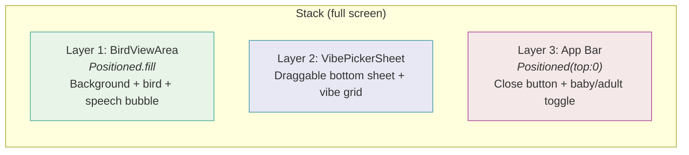
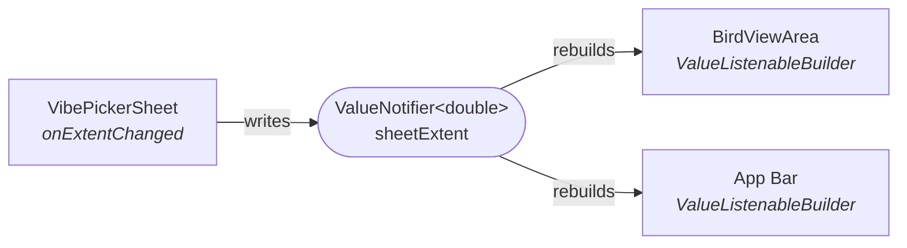
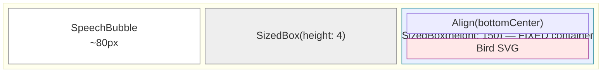
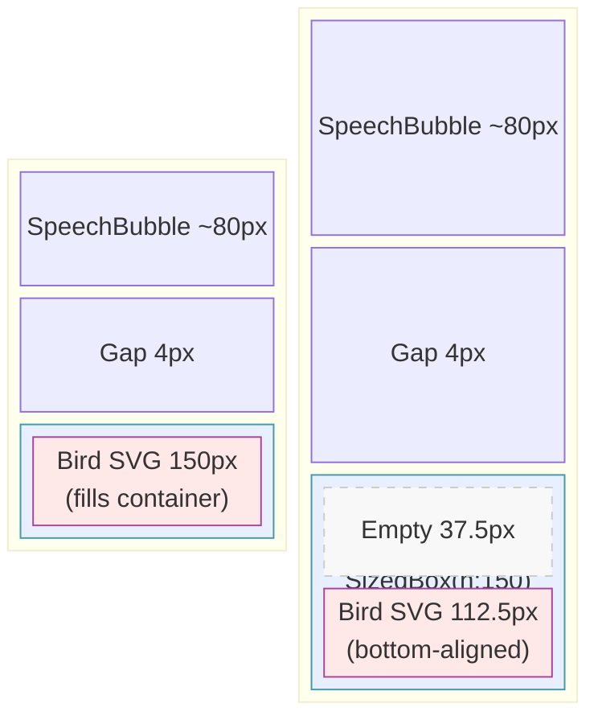
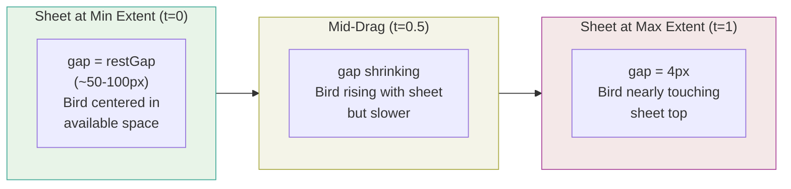
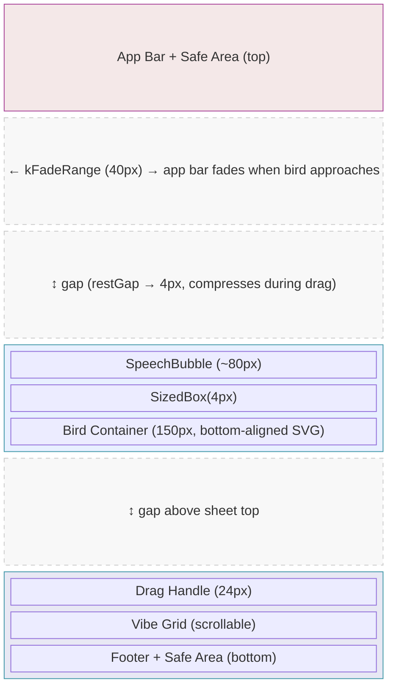
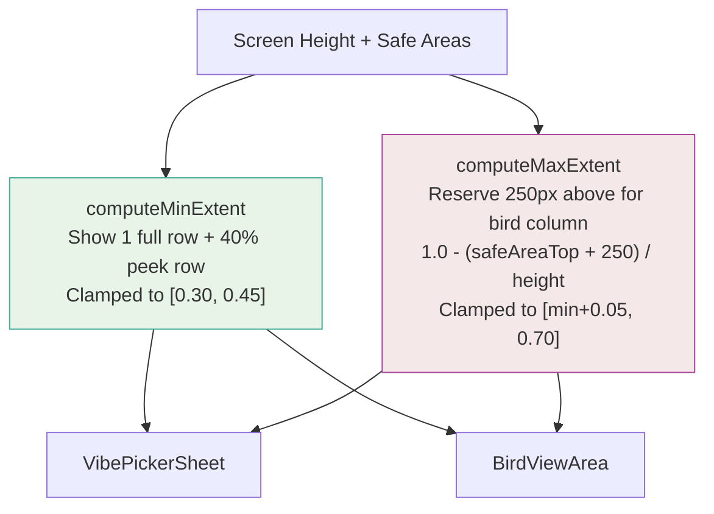
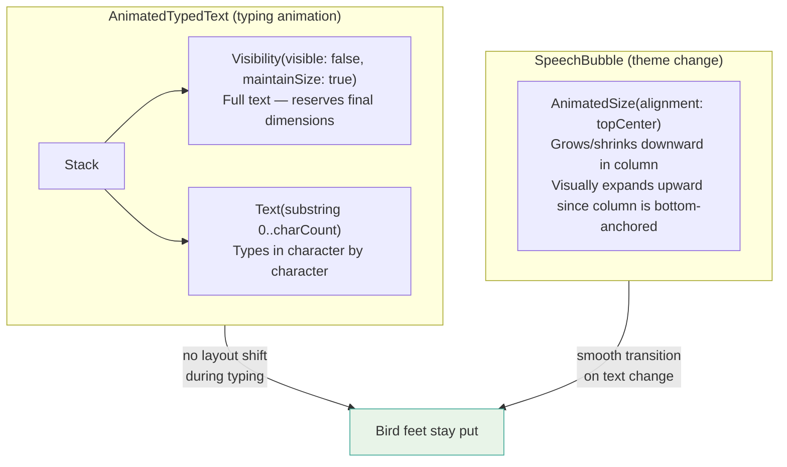
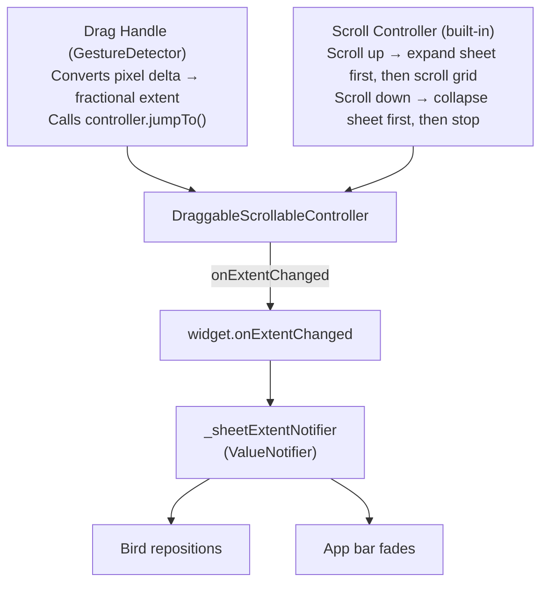

# Bird Layout System

How the bird, speech bubble, draggable sheet, and app bar interact to keep layout stable regardless of bird size or sheet position.

---

## Screen Layout: Three-Layer Stack

`VibeSelectionScreen` returns a `Stack` with three layers (back to front):



The layers are connected by a single `ValueNotifier<double>` holding the current sheet extent (0.0-1.0). The sheet writes to it on drag; the bird area and app bar read from it via `ValueListenableBuilder`. This means **only the bird and app bar rebuild during drag** -- no full-screen `setState`.



---

## Bird + Speech Bubble: The Bottom-Anchored Column

In `bird_view_area.dart`, the bird and speech bubble form a single `Column(mainAxisSize: MainAxisSize.min)` with a **constant total height of 234px** (`kBirdColumnHeight`):



This column is positioned with:

```dart
Positioned(
  left: 16,
  right: 16,
  bottom: bottomOffset,  // = availableHeight * sheetExtent + gap
  child: column,
)
```

Since `bottom` is used, the column's **bottom edge** (the bird's feet) is pinned at exactly `sheetHeight + gap` pixels from the screen bottom.

---

## How Baby/Adult Size Changes Don't Shift the Speech Bubble

The bird SVG sits inside a **fixed 150px `SizedBox`** with `Align(alignment: Alignment.bottomCenter)`:



- **Adult (150px):** Fills the entire 150px container. Feet touch the bottom edge.
- **Baby (112.5px):** Leaves 37.5px of empty space *above*. Feet still touch the same bottom edge.

The column height stays at 234px in both cases. The speech bubble's position never changes.

---

## The Parallax Gap

The `gap` between the sheet's top edge and the bird's feet compresses as the sheet drags up:



The computation:

```dart
final t = ((sheetExtent - minExtent) / (maxExtent - minExtent)).clamp(0.0, 1.0);
final gap = restGap + (4.0 - restGap) * t;
final bottomOffset = availableHeight * sheetExtent + gap;
```

As the user drags the sheet up, the bird rises with it but the gap compresses, creating a subtle parallax where the bird moves slightly slower than the sheet.

---

## Full Positioning Diagram

A vertical slice of the screen showing how everything stacks from bottom to top:



---

## Dynamic Extent Computation

Both min and max extents are computed in `didChangeDependencies()` based on screen size:



The 250px reservation for max extent breaks down as:
- Top margin: 12px
- Speech bubble: 80px
- Bubble-to-bird gap: 4px
- Bird container: 150px
- Min gap to sheet: 4px

---

## Speech Bubble Text Stability

Two mechanisms prevent text changes from jittering the bird:



1. **During typing:** The invisible full text immediately reserves the final size. No incremental layout shifts.
2. **On theme change:** `AnimatedSize(alignment: topCenter)` grows the bubble downward within the column. Since the column is bottom-anchored, visually the bubble expands upward while the bird's feet remain stationary.

---

## The Draggable Sheet

The sheet accepts two independent drag inputs:



---

## App Bar Fade

The app bar replicates the same gap logic from `BirdViewArea` to compute the bird column's top edge, then fades based on proximity:

```dart
birdColumnTop = screenHeight * (1 - sheetExtent) - gap - kBirdColumnHeight
distance = birdColumnTop - appBarBottom
opacity = (distance / kFadeRange).clamp(0.0, 1.0)  // kFadeRange = 40px
```

Below 0.1 opacity, `IgnorePointer(ignoring: true)` disables hit testing so taps pass through to the bird area behind.

---

## Key Insight

The approach **decouples the bird's visual size from its layout footprint**. The fixed 150px `SizedBox` + `Align(bottomCenter)` means the column always occupies exactly 234px regardless of which bird asset is rendered. The speech bubble sits above a constant-height container, and the whole column is bottom-anchored to track the sheet. You could swap in any bird asset of any size (up to 150px) and the speech bubble, feet position, and sheet relationship all remain perfectly stable.
