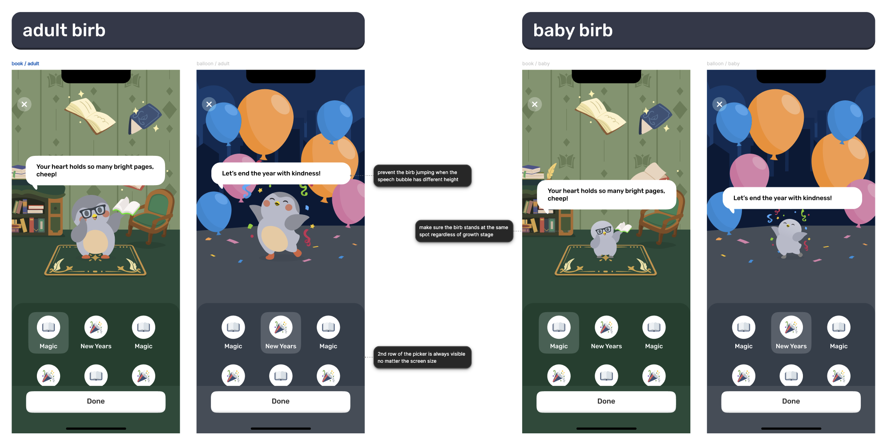

## Requirements
- We'd like you to build a small recreation of our "Send Good Vibes" screen, matching as closely as possible the provided mock. Ideally the background will switch between the "Books" background for selecting "Magic" and the "Balloon" background for selecting "New Years".
- Something we frequently do in the Finch app is position a bird on a background, and ensure that it is positioned correctly with other elements (in this case, the background and the speech bubble).
	- We'd like you to ensure that the speech bubble text can change line length without causing the bird to reposition.
	- Make sure that the bird stands in the same position as both a baby and adult. In the actual Finch codebase, the bird has "growth stages" which change it's size. In this exercise, this can be mimicked with the toggle at the top of the screen.
- Solve the drawer layout so that the 2nd row of the vibes picker is always visible even on smaller screens. (You can use iPhone SE in device_preview to verify this).

## Resources
- This app is a very barebones flutter app purely for the purpose of this exercise. You shouldn't feel compelled to keep any of the existing layout or code, but we wanted to provide something to get you started. If you would solve certain pieces of it differently, feel free to show us how you would approach it.
- You should have all the assets you need within the assets directory but please reach out if you need anything.
